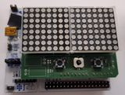
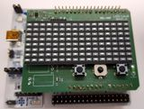
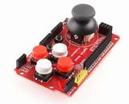
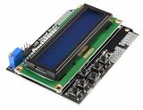
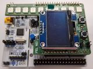
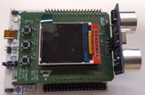
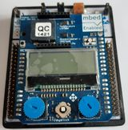

# KEI-MAP
Materiály pro samostatnou práci KEI/MAP v.2024

Podklady jsou rozdělené podle jednotlivých HW modulů/shieldů v adresářích.
Kód "knihovních" souborů je v adresáři Inc a Src, v popisu modulů jsou uvedeny potřebné soubory.

|Červené LED 16x8|Modré LED 16x8|GameShield|LCD keypad|
|---|---|---|---|
|||||
|8x 7-segment LED|OLED + RGB LED|TFT + sonar|MBED shield|
|||||

Jsou doplněny i podklady pro výukové shieldy (modrý i zelený).

Signály na Arduino konektorech Nucleo desky - vhodné pro zjištění mapování GPIO a speciálních funkcí:

