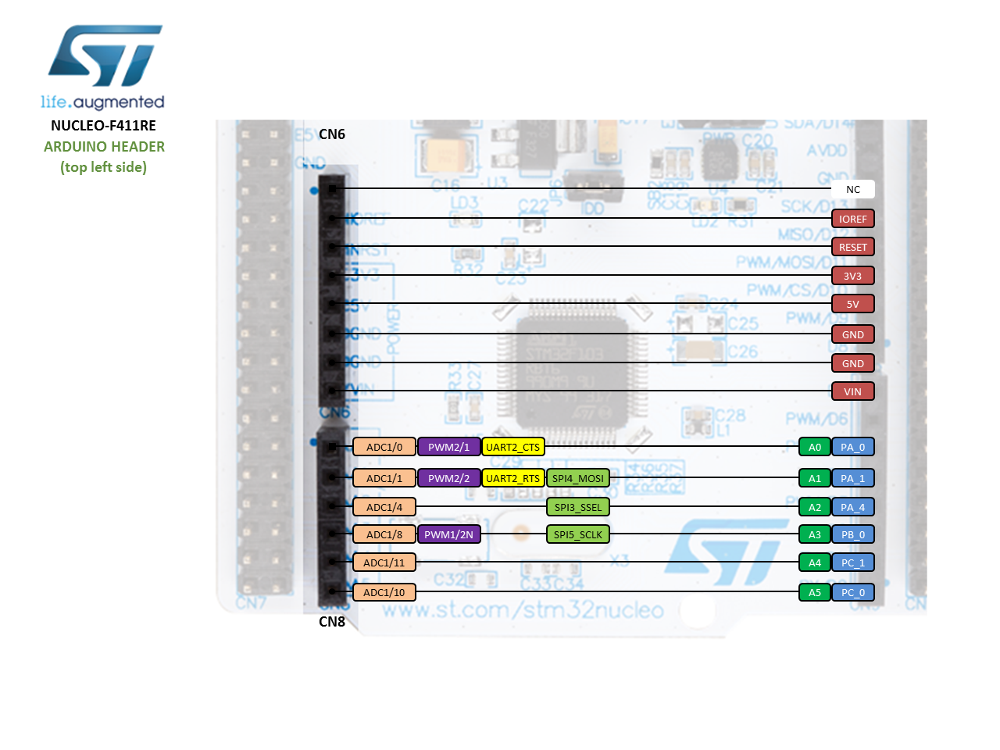
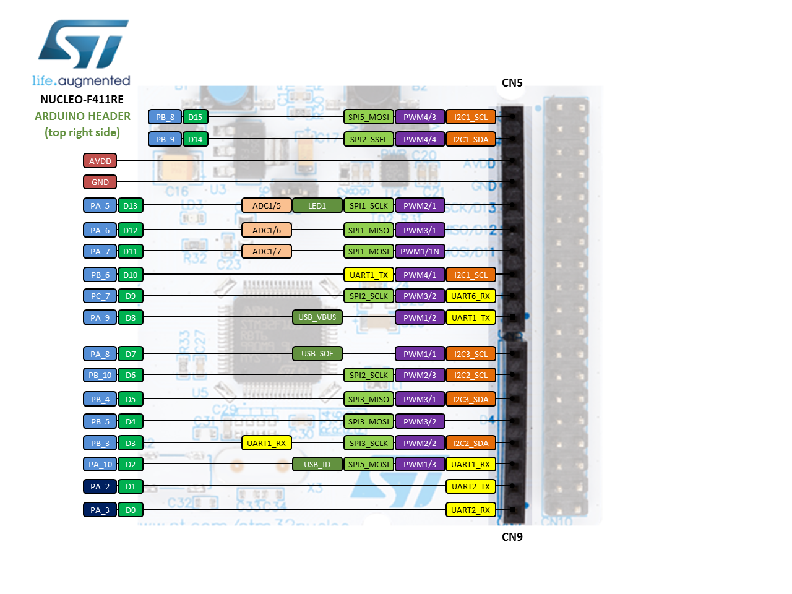

# KEI-MAP
Materiály pro samostatnou práci KEI/MAP v.2024

Podklady jsou rozdělené podle jednotlivých HW modulů/shieldů v adresářích.
Kód "knihovních" souborů je v adresáři Inc a Src, v popisu modulů jsou uvedeny potřebné soubory.

Jsou doplněny i podklady pro výukové shieldy (modrý i zelený).

Signály na Arduino konektorech Nucleo desky - vhodné pro zjištění mapování GPIO a speciálních funkcí:

