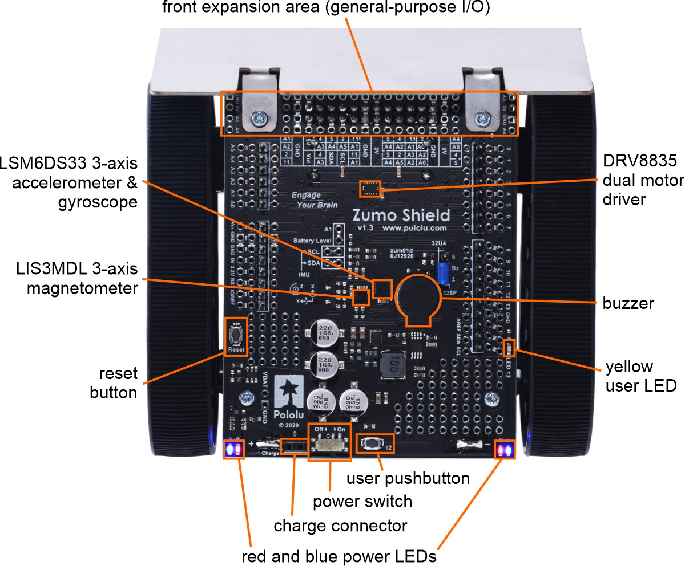
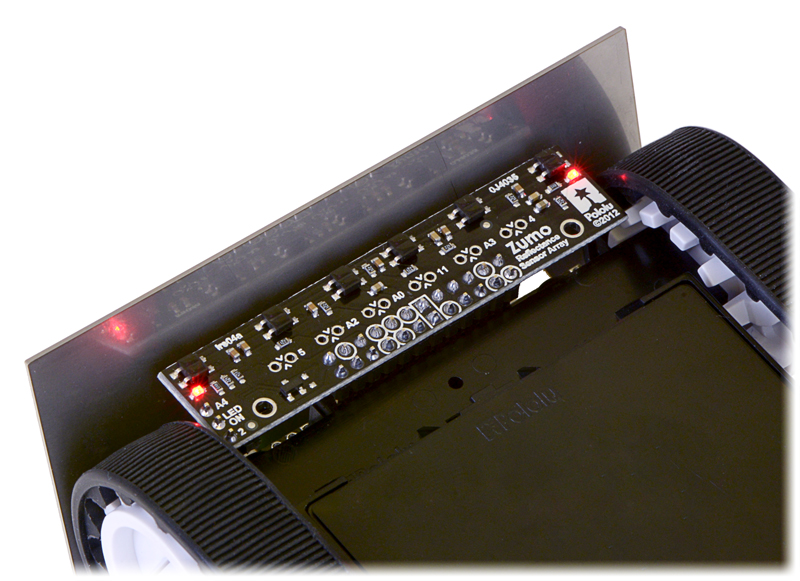

# ZUMO robot (Pololu)

## Připravená knihovna (předběžně stále ve vývoji)

### DC motory robota a periférie na řídící desce

* **stm_core_addon.h** a **stm_core_addon.c**
  * rozšíření z "běžného" stm_core o funkce pro zjištění busclock a timerclock
  * interně používané při inicializaci časovačů
* Hlavní soubory k Zumo robotu - **pololu_zumo.h** a **pololu_zumo.c**
* Motory jsou řízeny PWM z čítačů
  * Interně se používá TIM3/2 pro pravý motor a TIM4/1 pro levý
  * GPIO slouží k řízení směru
  * Použité budiče DRV8835
* Ostatní bloky mají buď podporu v "knihovně" nebo je možné doprogramovat ručně
  * Pípák - GPIOB,3 - TIM2/2 - **nemá podporu v knihovně**
    * Pomocí jumperu možno změnit na GPIOB,10
  * MEMS akcelerometr/gyro a kompas/magnetometr - na I2C - **není v knihovně**
    * Konkrétní typy se liší podle verze desky - viz. schémata
  * Vstup pro A/D měření napětí z baterií - GPIOA,1 - zapojený z děliče 2/3 VCC - **není v knihovně**
  * Tlačítko - GPIOA,6 - bokem na zadní straně
  * Žlutá LED - GPIOA,5 - pro indikaci
  * Řízení přisvětlovacích IR LED senzorů - GPIOC,1
    * Může být změněno na GPIOA,10 (toto není podporováno knihovnou)
```C++
  bool Pololu_Zumo_ButtonState(void);
  void Pololu_Zumo_YellowLED(bool lightOn);
  void Pololu_Zumo_SensorLED(bool lightOn);
```
* Doporučená inicializace motorů a ostatních GPIO
```C++
...
  if (!Pololu_Zumo_InitMotors())
  {
    puts("Fail init Zumo motors");
    while (1)
      ;
  }
...
```
* Nastavení rychlosti v rozsahu -100..0..100 s tím, že 0 = stop
```C++
  void Pololu_Zumo_Motors(int leftVal, int rightVal);
```

### Práce se senzory čáry
* Z knihovny se využívají soubory **pololu_qtr.h** a **pololu_qtr.c**
* Inicializace
  * Připojení QTR senzorů na konkrétní GPIO je předdefinováno v "knihovně", při inicializaci stačí použít "známy" typ zařízení, zde "QTR_Device_Zumo"
  * **Interně využívá TIM5 a jeho přerušení**
```C++
  if (!Pololu_QTR_InitSensors(QTR_Device_Zumo))
  {
    puts("Fail init QTR sensors");
    while (1)
      ;
  }
```
* Senzory se měří kontinuálně v přerušení od časovače TIM5
  * Princip měření QTR senzorů typu "měření intervalu"
    * Po dobu cca 10us se nabíjí interní C senzoru = GPIO nastaven jako výstup s log. 1
    * Následně se GPIO přepne na vstup a probíhá "pozvolné" vybíjení C přes fototranzistor
    * Doba vybíjení je úměrná míře dopadající světla, tj. zde odraženého od povrchu - detekce tmavé čáry na světlém pozadí (příp. lze i inverzně)
    * V okamžiku kdy exponenciální průběh na vstupu klesne pod rozhodovací úroveň, je detekován konec pulsu a jeho doba je uložena do pole "raw" hodnot
* Před použitím senzorů je potřeba:
  * Povolit měření pro knihovnu QTR
  * Zapnout napájení přisvětlovacích LED senzorů
    * Je indikováno červenými LED po straně nezorového PCB
    * Pozor, funkce je v zumo.c části knihovny
```C++
  Pololu_QTR_EnableMeassure(true);
  Pololu_Zumo_SensorLED(true);
```
* Práce s kalibrací - doporučený postup
  * Napřed resetovat vniřní hodnoty max a min
  * Otáčet robotem na místě tak, aby se všechny senzory dostaly jak nad čáru, tak na světlé (bílé) okolí
    * Ideální je "rohlédnutí" - otočit se na místě přibližně 90 stupňů doprava, pak 180 doleva a zpět 90 doprava
      * Dobu a rychlost otáčení nutno určit experimentálně  * Během otáčení volat funkci "StepCalibrate"
    * Během toho se pro všechny senzory nastaví hodnota pro "černou" a "bílou" a kalibrované hodnoty pak je možné číst přepočítané v rozsahu 0..1000
```C++
  bool Pololu_QTR_ClearCalibrate(void);
  bool Pololu_QTR_StepCalibrate(void);
```
* Čtení senzorů při jízdě
  * Z knihovny je možné získat jak "raw" hodnoty, tak přepočtené podle zkaliborovaných rozsahů černá-bílá
    * Vrací poslední změřená data, interně se používá double-buffer princip, takže by se tato data neměla měnit během měření
  * Funkcím je potřeba předat ukazatel na paměť, kam knihovna ty 16-bitové hodnoty má naplnit
    * Aktuálně se používá 6 senzorů - viz. inicializace pro zařízení "zumo-robot"
```C++
  bool Pololu_QTR_FillSensors(uint16_t *pSens);
  bool Pololu_QTR_FillSensRaw(uint16_t *pSens);
```




## Další zdroje informací pro možný vlastní vývoj
* [Zumo robot "for arduino"](https://www.pololu.com/product/2510) - stránka firmy Pololu
* [Zumo Reflectance Sensor Array](https://www.pololu.com/product/1419) - stránka firmy Pololu

* [Schéma pro v 1.2](zumo-shield-v1.2-schematic.pdf)
* [Schéma pro v 1.3](zumo-shield-v1.3-schematic.pdf)
* [Schéma senzory](./zumo-reflectance-sensor-array-schematic-diagram.pdf)
