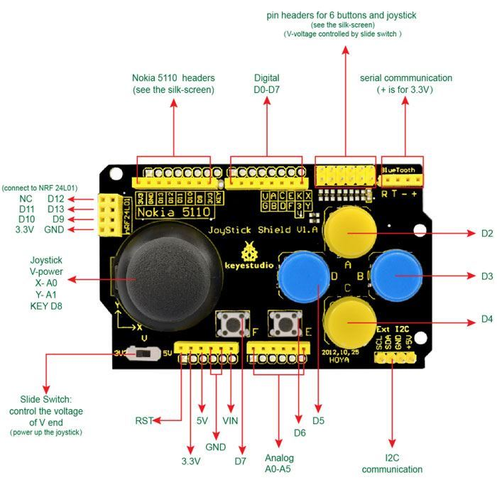

# Gamepad Joystick Shield 

**POZOR** - Pokud nejde nahrát program do mikrokontroléru při nasazeném shieldu, nejspíš zapájené vývody tlačítek "mačkají" RESET na Nucleo desce. Stačí shield o 1-2 milimetry "povytáhnout", aby k tomu nedocházelo.

Jedna z řady [stránek produktu](https://www.laskakit.cz/arduino-gamepad-joystick-shield/)

Layout (a signály) podobného:

* !!! Přepněte "Voltage switch" na **3v3**, určuje např. max. hodnotu napětí z potenciometru !!

Vytváření aplikace využívá **kódy ANSI terminálu** pro "lepší" výstup na terminál:
* Je potřeba použít terminál, který umí ANSI - např. [Putty](https://www.chiark.greenend.org.uk/~sgtatham/putty/latest.html)
* Info např. [Přehled ANSI](https://gist.github.com/fnky/458719343aabd01cfb17a3a4f7296797) nebo na [Wiki](https://en.wikipedia.org/wiki/ANSI_escape_code)
* ANSI povely začínají znakem ESC, což je bajt/znak s hodnotou 27 (0x1B) (v textu lze zapsat jako '\x1b'), pak je znak '[' a následně konkrétní akce:
  * **"\x1b[{row};{col}H"** - umístí kurzor na souřadnice, další text se vypisuje z této pozice - např. "\x1b[3;10H"
  * **"\x1b[2J"** - smaže "obrazovku" (okno terminálu)
  * **"\x1b[1;33m"** - nastaví žlutou barvu textu pro další výpisy (obecně příkaz 'm' je předřazen číselnou kombinací ovlivňující barvy)
