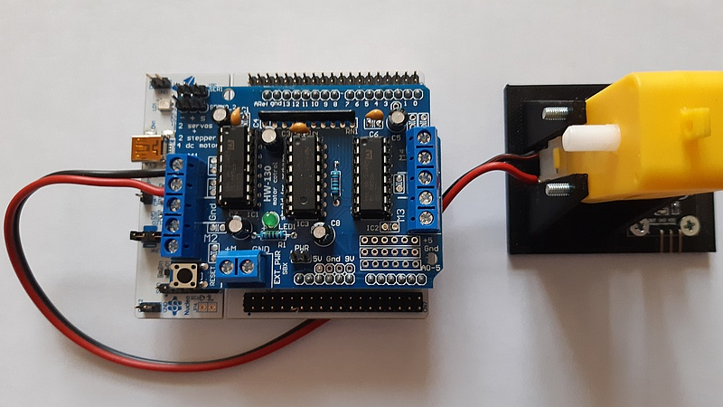
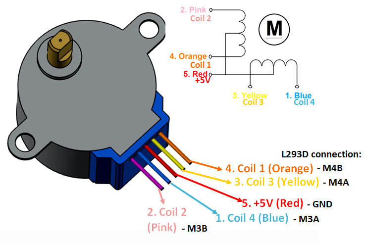

# Motor shield

## Připravená knihovna (předběžně stále ve vývoji)
* **stm_core_addon.h** a **stm_core_addon.c**
  * rozšíření z "běžného" stm_core o funkce pro zjištění busclock a timerclock
  * interně používané při inicializaci časovačů
* Potřebné soubory - **Shield_L293D.h** a **Shield_L293D.c**
* **Momentálně podporuje pouze "motor 1", "stepper 2" a "servo 1" (teoreticky možno provozovat najednou)**
  * Některé PWM výstupy jsou nevhodně zkombinované pro Nucleo, zatím dále neřešeno
* Doporučená inicializace pro motor_1
```C++
#define MOTOR_ID    1
...
  if (!motors_motor_enable(MOTOR_ID, 1500))    // 1.5kHz PWM
  {
    puts("Fail init motor");
    while (1)
      ;
  }
```
* Nastavení rychlosti v rozsahu 0-100 (dle inicializace PWM) a směru otáčení:
```C++
    if (!motors_motor_run(MOTOR_ID, speed, dir1))
      puts("Set motor speed");
    else
      printf("Motor speed: %d\n", speed);
```
* Připojení senzoru otáčení na libovolný GPIO pin na vnější řadě "Nucleo konektorů" a nastavit jako "vstup"
* Několik postřehů ke schématu zapojení (viz. také začátek .C souboru):
  * Řídící signály pro 2x dvojitý H-můstek L293D jsou připojené na '595
    * Sériově paralelní převodník, piny CLK = B5, SER = A9, EN = A8, LATCH = A6
    * Stejný je použít na shieldu v2 pro SPI LED
    * Výstupy pro "můstky":
      * QA - M3A
      * QB - M2A
      * QC - M1A
      * QD - M1B
      * QE - M2B
      * QF - M4A
      * QG - M3B
      * QH - M4B
  * Další signály (typicky PWM):
    * D2 - PA10 - JP3 - ??
    * D3 - PB3 - PWM2B - motor 2 = PWM2/2 (AF01)
    * D5 - PB4 - PWM0B - motor 3 = PWM3/1 (AF02)
    * D6 - PB10 - PWM0A - motor 4 = PWM2/3 (AF01)
    * D9 - PC7 - PWM1A - servo 2 = PWM3/2 (AF02)
    * D10 - PB6 - PWM1B - servo 1 = PWM4/1 (AF02)
    * D11 - PA7 - PWM2A - motor 1 = PWM1/1N (AF01), TIM3CH2 (AF02)
* Nejjednodušší připojení motoru 1:


## Další zdroje informací pro možný vlastní vývoj
Produktové stránky na laskakit.cz:
* [Motor shield](https://www.laskakit.cz/arduino-4-kanalovy-motor-driver-shield-l293d/)
* ["žlutý" motor](https://www.laskakit.cz/tt-motor-s-prevodovkou-plastove-prevody/)
* [Krokový motor 28BYJ-48](https://www.laskakit.cz/krokovy-motor-28byj-48/)
* [Mikroservo kontinuální](https://www.laskakit.cz/plastove-micro-servo-sg90-9g--kontinualni/)
* [Mikroservo](https://www.laskakit.cz/plastove-micro-servo-sg90-9g--180/)
* [Snímač otáček](https://www.laskakit.cz/fotoelektricky-snimac-otacek/)

Zapojení krokového motoru - viz. [zdroj](https://components101.com/motors/28byj-48-stepper-motor)


